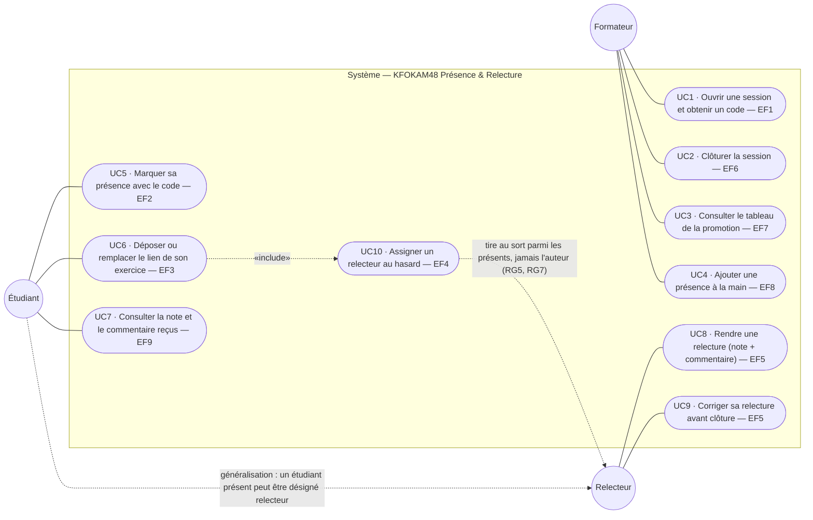

# D1 — Cas d'utilisation

Acteurs et frontière du système. Chaque cas d'utilisation renvoie à l'exigence
fonctionnelle correspondante du [cahier des charges](../CAHIER_DES_CHARGES.md).

**Lecture.** Le relecteur n'est pas un acteur distinct mais un **rôle temporaire**
porté par un étudiant présent à la session (section 2 du cahier des charges) :
d'où la généralisation `Étudiant → Relecteur` plutôt qu'un troisième acteur
indépendant. Conséquence sur D2 : aucune table `Relecteur`, seulement une
association `Relecture.relecteurId → Utilisateur.id`.
