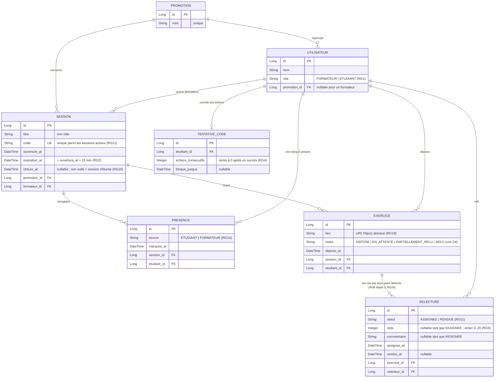

# D2 — Modèle de données

Ce diagramme fait foi pour les migrations Flyway (`backend/src/main/resources/db/migration`).
Toute évolution du schéma se fait par **une nouvelle migration** et une mise à jour
de ce diagramme dans le même commit (contrainte B5).

> **Étape 3 — ce diagramme a changé.** Le client a révoqué Q6 : un exercice est
> désormais relu par **deux** pairs distincts. Les éléments barrés ci-dessous
> sont ce qui était vrai au jalon `v0.1` ; ils sont conservés pour que
> l'historique reste lisible.

## Contraintes portées par les migrations

| Table | Contrainte | Règle | Code d'erreur |
|---|---|---|---|
| `presence` | `UNIQUE (session_id, etudiant_id)` | RG15 | `409 DEJA_PRESENT` |
| `exercice` | `UNIQUE (session_id, etudiant_id)` | RG16 | `409 EXERCICE_DEJA_DEPOSE` |
| `relecture` | ~~`UNIQUE (exercice_id)`~~ **retirée en V2** — elle matérialisait « un seul relecteur » | ~~RG6 (Q6)~~ périmée | — |
| `relecture` | `UNIQUE (exercice_id, relecteur_id)` **ajoutée en V2** — deux relecteurs *distincts* | RG24 | `409 CONFLIT_CONCURRENT` |
| `relecture` | `CHECK (note IS NULL OR note BETWEEN 0 AND 20)` | RG9 | `400 NOTE_INVALIDE` |
| `relecture` | `CHECK (relecteur_id <> exercice.etudiant_id)` — vérifié en service | RG5 | `403 AUTO_RELECTURE` |
| `session` | `UNIQUE (code)` **global** — et non restreint aux sessions actives comme envisagé ici au départ : un index partiel n'est pas portable sur H2, où tournent les tests. Une unicité globale est plus forte, donc toujours suffisante pour RG21 | RG21 | — |
| `presence` / `exercice` | `source` et `statut` stockés en `VARCHAR` + `CHECK`, pas en `ENUM` natif | portabilité H2 / PostgreSQL | — |

## Choix de modélisation

- **Une seule table `utilisateur`** avec un champ `role`, plutôt que deux tables :
  un formateur et un étudiant partagent exactement les mêmes attributs, et
  `presence`, `exercice`, `relecture` pointent toutes vers la même clé.
- **La `relecture` est créée dès l'assignation**, au statut `ASSIGNEE`, note nulle.
  C'est ce que suppose le contrat imposé : `POST /api/relectures/{id}` reçoit un
  identifiant de relecture **existant**. C'est aussi ce qui rend calculable
  `relecturesEnAttente` du tableau (RG11, Q11).
- **`TENTATIVE_CODE` est persistée** et non gardée en mémoire : le blocage de
  deux minutes (RG4, Q4) doit survivre à un redémarrage, sinon la règle se
  contourne trivialement.
- **`moyenne` n'est stockée nulle part** : elle est recalculée par l'API à la
  lecture du tableau (RG19, contrainte F3). Depuis l'étape 3, c'est une
  **moyenne de moyennes** — note d'exercice d'abord, moyenne de l'étudiant
  ensuite (H13). Ne rien stocker évite d'avoir à réécrire des notes existantes
  quand la règle de calcul change, ce qui vient précisément d'arriver.
- **La cardinalité `exercice → relecture` passe de 0..1 à 0..2** (étape 3).
  Le changement se fait par une migration **V2 ajoutée**, jamais en modifiant
  `V1__schema_initial.sql` : retrait de `UNIQUE (exercice_id)`, ajout de
  `UNIQUE (exercice_id, relecteur_id)`. Les lignes existantes — un relecteur
  par exercice — restent valides sous la nouvelle contrainte, et aucune
  seconde relecture ne leur est inventée (H14).
