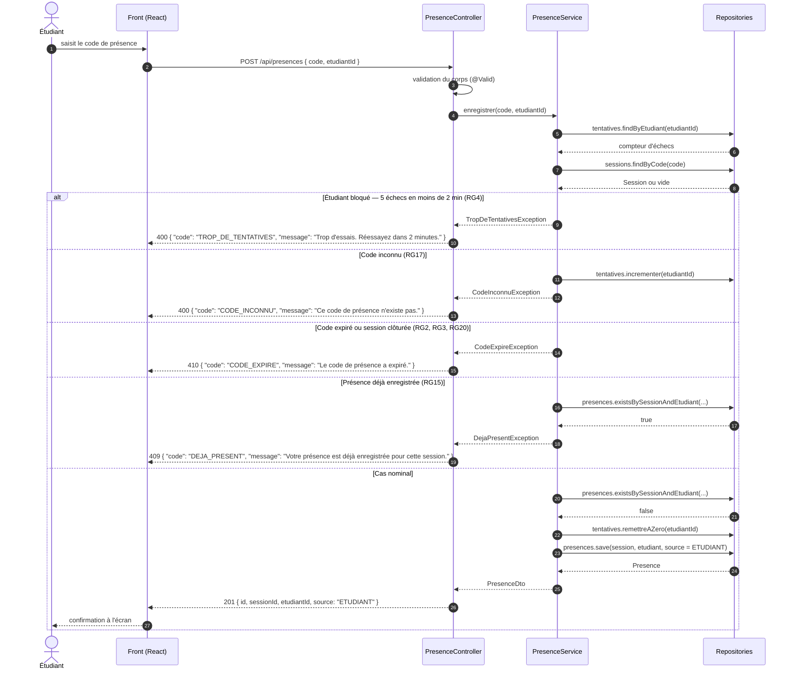

# D3 — Séquence : marquer sa présence

Cas nominal et cas d'erreur. Les codes de statut et les codes d'erreur repris ici
sont **exactement** ceux de `api/contrat.yaml` pour `POST /api/presences`
(`201` · `400` · `409` · `410`).

## Correspondance avec le contrat

| Situation | Règle | Statut HTTP | `code` d'erreur |
|---|---|---|---|
| Présence enregistrée | EF2 | `201` | — |
| Corps invalide (`code` ou `etudiantId` manquant) | B4 | `400` | `CHAMP_MANQUANT` |
| Code inexistant | RG17 | `400` | `CODE_INCONNU` |
| Trop de tentatives | RG4 | `400` | `TROP_DE_TENTATIVES` |
| Code expiré (> 15 min) ou session clôturée | RG2, RG3, RG20 | `410` | `CODE_EXPIRE` |
| Étudiant déjà présent | RG15 | `409` | `DEJA_PRESENT` |

> **Pourquoi `400` et non `429` pour RG4 ?** Le contrat est imposé : les seuls
> statuts autorisés sur `POST /api/presences` sont `400`, `409` et `410`.
> Ajouter un `429` sur une opération imposée sortirait du contrat. Le blocage est
> donc signalé par un `400` porteur du code métier `TROP_DE_TENTATIVES`.
> Décision tracée en section 7 du cahier des charges.

> **Pourquoi `400` et non `404` pour un code inconnu ?** C'est ce qu'impose le
> contrat : la ressource créée est la présence, pas la session ; le code est une
> donnée d'entrée invalide, donc `400`.
