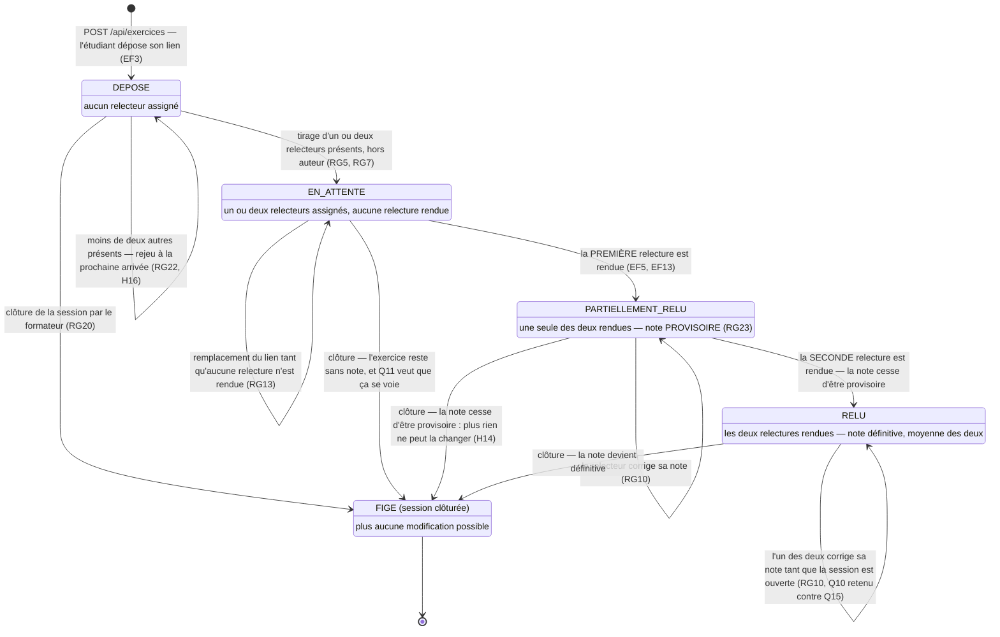

# D4 — États-transitions : cycle de vie d'un exercice

*Quatrième diagramme, facultatif (bonus +3 points du barème).*

> **Étape 3 — ce diagramme a changé.** Le passage à deux relecteurs ajoute un
> état, `PARTIELLEMENT_RELU` : une note issue d'une seule des deux relectures
> est **provisoire** (RG23, H18). `DEPOSE` change aussi de sens — « aucun
> relecteur assigné » et non plus « aucun relecteur disponible ».
>
> Une subtilité vaut d'être lue : **la clôture fait sortir de l'état
> provisoire**. Tant que la séance est ouverte, la seconde relecture peut
> encore arriver ; une fois close, plus rien ne bougera, et présenter la note
> comme provisoire mentirait au lecteur (H14).

Les trois états correspondent au champ `exercice.statut` de D2 et à la valeur
`statut` renvoyée par `POST /api/exercices` (`201 { id, statut }`).

## Lecture

| Transition | Déclencheur | Effet observable |
|---|---|---|
| `[*] → DEPOSE` | `POST /api/exercices` | `201 { id, statut: "DEPOSE" }` ; `exercicesDeposes` +1 dans le tableau |
| `DEPOSE → EN_ATTENTE` | tirage automatique d'un relecteur | une ligne `relecture` au statut `ASSIGNEE` ; `relecturesEnAttente` +1 pour le relecteur |
| `EN_ATTENTE → RELU` | `POST /api/relectures/{id}` | `relecture.statut = RENDUE` ; la note entre dans la `moyenne` de l'auteur |
| `RELU → RELU` | nouvel appel sur la même relecture, session ouverte | `200` ; la moyenne est recalculée |
| `* → FIGE` | clôture de la session | tout nouvel appel renvoie `409 SESSION_CLOTUREE` |

**Un exercice peut rester `DEPOSE`** : si aucun autre étudiant n'est présent à la
session, il n'existe aucun relecteur éligible (RG5 interdit l'auto-relecture) et
le tirage est rejoué à chaque nouvelle présence. Ce cas est documenté en
section 7 du cahier des charges.

**`RELU → RELU` est la conséquence directe** de l'arbitrage Q10 contre Q15
(section 7). Si l'arbitrage inverse avait été retenu, cette boucle disparaîtrait
et `POST /api/relectures/{id}` renverrait `409 RELECTURE_DEJA_RENDUE` dès le
second appel.
